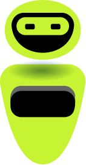

  

# Iakadir Projet Swift

Iakadir est mon tout premier projet Swift.  
Le but était de faire ma première application mobile IOS de A à Z.

## Pourquoi ce projet ?
- Pratiquer le Swift et SwiftUI
- Avoir une vision complète de ce qu’on peut faire dans une app
- Faire les bons choix de technos et de SDK

## Roadmap du projet

### Étape 1 — UI (maquette -> app)
La première étape du projet, c’est d’implémenter l’UI en reproduisant la maquette.

### Étape 2 — Backend + notifications
La deuxième étape, c’est de mettre en place le backend et d’ajouter un système de notifications.  
Avec Superbase.

## Objectifs
- Avoir une authentification fonctionnelle
- Récupérer un profil après la création de compte
- Avoir une Remote Config pour activer/désactiver des fonctionnalités
- Avoir une API qui renvoie les résultats des chats, images générées et audio transcrits
- Avoir un système de notifications

## Notes
L’intégration de l’API (chat, image, audio) a été la partie la plus longue et la plus complexe du projet.  
Côté UI, certains détails de la maquette n’ont pas pu être reproduits à 100% par manque de temps, et quelques bugs d’affichage se sont déclenchés de manière inattendue pendant le développement.  
Enfin, certaines améliorations prévues (comme l’analytics / tracking) ont été repoussées pour prioriser au niveau de l’intégration API et les fonctionnalités de base de l'app.
Je compte continuer ce projet !
